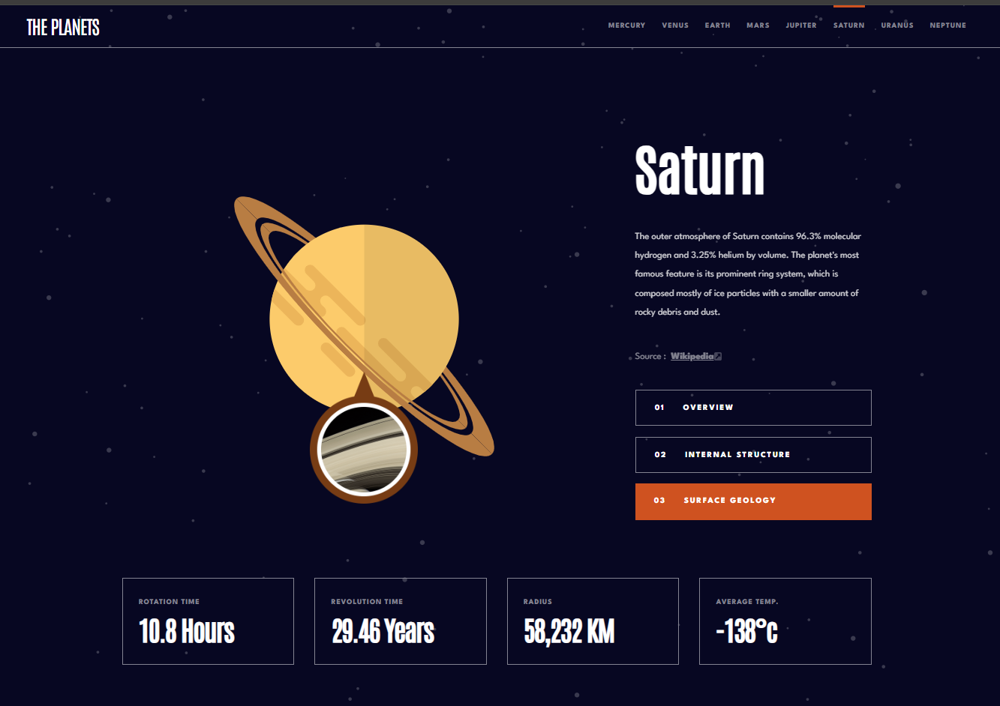

# Frontend Mentor - Planets fact site solution

This is a solution to the [Planets fact site challenge on Frontend Mentor](https://www.frontendmentor.io/challenges/planets-fact-site-gazqN8w_f). Frontend Mentor challenges help you improve your coding skills by building realistic projects. 

## Table of contents

- [Overview](#overview)
  - [The challenge](#the-challenge)
  - [Screenshot](#screenshot)
  - [Links](#links)
- [My process](#my-process)
  - [Built with](#built-with)
  - [What I learned](#what-i-learned)
  - [Useful resources](#useful-resources)
- [Author](#author)


## Overview

### The challenge

Users should be able to:

- View the optimal layout for the app depending on their device's screen size
- See hover states for all interactive elements on the page
- View each planet page and toggle between "Overview", "Internal Structure", and "Surface Geology"

### Screenshot




### Links

- Solution URL: [https://github.com/AcharaChisomSolomon/planets-fact-site](https://github.com/AcharaChisomSolomon/planets-fact-site)
- Live Site URL: [https://creative-sunburst-fb0053.netlify.app/](https://creative-sunburst-fb0053.netlify.app/)

## My process

### Built with

- Semantic HTML5 markup
- CSS custom properties
- Flexbox
- CSS Grid
- Mobile-first workflow
- [React](https://reactjs.org/) - JS library
- [Emotion](https://emotion.sh/docs/introduction) - For styles

### What I learned

First major project I used CSS GRID on.

```js
const Wrapper = styled.div`
  display: grid;
  grid-template-rows: auto 434px auto auto;
  gap: calc(33 / 16 * 1rem);

  @media ${QUERIES.tabletAndLarger} {
    max-width: calc(calc(1110 / 16 * 1rem) + calc(24 / 16 * 2rem));
    padding: 0 calc(24 / 16 * 1rem);
    margin: 0 auto;

    grid-template-rows: 550px auto auto;
    grid-template-columns: 50% 1fr;
  }

  @media ${QUERIES.laptopAndLarger} {
    margin-top: 125px;
    gap: 43px;
    grid-template-columns: 1fr 350px;
    grid-template-rows: repeat(3, auto);
  }
`;
```


### Useful resources

- [UI DEV](https://ui.dev/c/react) - This helped me become really comfortable with react.
- [CSS FOR JS](https://courses.joshwcomeau.com/css-for-js) - This deepened my mental model of CSS.


## Author

- Frontend Mentor - [@AcharaChisomSolomon](https://www.frontendmentor.io/profile/AcharaChisomSolomon)
- Twitter - [@Chisom14Solomon](https://x.com/Chisom14Solomon/highlights)